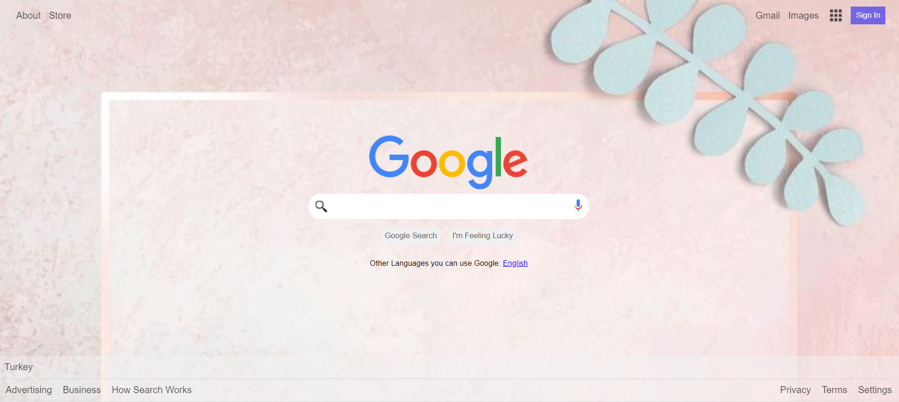

<p align="center">
<a href="https://www.linkedin.com/in/ozkan-komu/" target="_blank"></a>
</p>


## Project: Google Landing Page


## Table of contents

  - [Overview](#overview)
  - [Screenshot](#screenshot)
  - [Project Skeleton](#project-skeleton)
  - [Links](#links)
  - [Project Scope](#Project-Scope)
  - [Useful resources](#useful-resources)
- [Author](#author)


## Overview
👨‍💻 In this project I mastered division and professional cloning skills.We used mainly HTML and CSS. You can see visual representation of the website above. The objective is to build out this landing page and get it looking as close to the professional design as possible..


## Screenshot

<p align="center">
<a href="https://ozkankomu.github.io/Google_Landing_Project/"></a>
</p>


## Project Skeleton 

```
google-landing-page (directory)
|
|----README.md                  
|----images              
        |----appicon.png   
        |----gfavicon.png
		    |----google_microphone.png
		    |----googlelogo.png
		    |----icon-menu.jpg
		    |----magnifying_glass.png
|----solution
        |----index.html  
        |----style.css   
        |----images
```


## Links
<b>Check The Live Website ➡️</b> <a href="https://ozkankomu.github.io/Google_Landing_Project/">Live Website</a>


### Project Scope🎯
- HTML 

- List Properties-Tables / CSS-The Display Property-The position Property

- Overflow Property-The float Property-Opacity / Transparency-Units in CSS

- CSS Setting height and width-CSS Outline-CSS Combinators


### Purpose of Project;
👨‍💻 The main aim of this project is to improve my <b>HTML/CSS/git commands (push, pull, commit, add etc.) skills and ©️cloning abilities</b>.


## Notes
- You can use HTML,and CSS to complete this project.


### Useful resources
- [W3 Schoold](https://www.w3schools.com/) - This helped me for basics of website paradigm. I really liked this pattern and will use it going forward.
- [MDN](https://developer.mozilla.org/en-US/) - This is an amazing document which helped me finally understand deep sides of web development. I'd recommend it to anyone still learning these concepts.


## Author

- Author - [Ozkan]

<center> ⌛ Happy Coding  ✍ </center>

